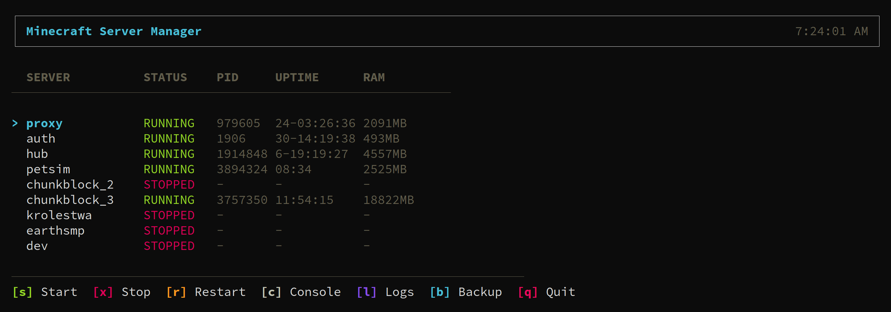

# 🎮 Minecraft CLI Admin

[](https://nodejs.org/)
[](https://www.typescriptlang.org/)
[](LICENSE)

**Modern terminal UI for managing Minecraft servers.** Start, stop, monitor, and backup your servers with a beautiful interactive dashboard.

<p align="center">
  
</p>

## ✨ Features

- 🖥️ **Interactive TUI Dashboard** - Real-time server status with keyboard controls
- 🚀 **Multi-Server Support** - Manage Spigot, Paper, Velocity proxy from one place
- 📊 **Live Monitoring** - PID, uptime, RAM usage at a glance
- 💾 **Smart Backups** - Local & S3 with automatic compression (zstd/xz/gzip)
- 🔌 **Console Access** - Attach to server console directly from dashboard
- ⌨️ **Tab Completion** - Bash & Zsh autocompletion for commands and server names
- 🛡️ **Graceful Shutdown** - Safe server stops with fallback force kill

## 🚀 Quick Start

```bash
git clone https://github.com/your-repo/minecraft-cli-admin.git
cd minecraft-cli-admin
./install.sh
```

**Requirements:** Node.js 18+, screen, Java

## 📖 Usage

```bash
mc-cli dashboard              # Interactive TUI
mc-cli status                 # Show all servers
mc-cli start <server>         # Start server
mc-cli stop <server>          # Stop server
mc-cli backup <server>        # Create backup
mc-cli console <server>       # Attach to console
```

## 🎹 Dashboard Controls

| Key | Action |
|-----|--------|
| `↑` `↓` | Navigate servers |
| `s` | Start server |
| `x` | Stop server |
| `r` | Restart server |
| `c` | Open console |
| `l` | Toggle logs |
| `b` | Create backup |
| `q` | Quit |

## ⚙️ Configuration

Config auto-created at `/opt/minecraft/config.json`:

```json
{
  "servers": {
    "survival": {
      "type": "spigot-params",
      "path": "/opt/minecraft/survival",
      "port": 25565
    }
  },
  "server_types": {
    "spigot-params": {
      "memory": "4G",
      "min_memory": "1G",
      "jvm_flags": ["-XX:+UseG1GC", "..."]
    }
  }
}
```

## 🔧 Tab Completion

```bash
# Bash
echo 'eval "$(mc-cli completion bash)"' >> ~/.bashrc

# Zsh
echo 'eval "$(mc-cli completion zsh)"' >> ~/.zshrc
```

## 📦 Tech Stack

- **Runtime:** Node.js 18+
- **Language:** TypeScript
- **CLI Framework:** Commander.js
- **TUI:** Ink (React for terminals)
- **Validation:** Zod
- **Process Management:** GNU Screen

## 🤝 Contributing

Contributions welcome! Feel free to open issues and pull requests.

## 📄 License

Apache License 2.0
