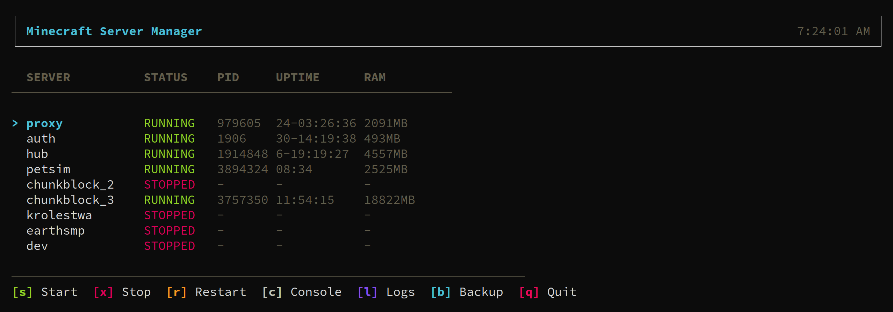

# Minecraft CLI Admin

[](https://nodejs.org/)
[](https://www.typescriptlang.org/)
[](LICENSE)

Modern terminal UI for managing Minecraft servers. Start, stop, monitor, edit config, and create backups from one dashboard.

<p align="center">
  
</p>

## Features

- Interactive Ink dashboard with live status, details, and runtime metrics
- Multi-server support for Spigot, Paper, and Velocity-style setups
- Backup workflows with local compression and optional S3 upload
- Inline configuration editor for servers and server types
- Shell completion for Bash and Zsh
- Graceful shutdown and console attach through `screen`

## Install

```bash
npm install -g minecraft-cli-admin
```

Install the latest GitHub Release without cloning:

```bash
curl -fsSL https://github.com/arthurr0/minecraft-cli-admin/releases/latest/download/install-release.sh | bash
```

Install from a local checkout for development:

```bash
git clone https://github.com/arthurr0/minecraft-cli-admin.git
cd minecraft-cli-admin
./install.sh
```

Requirements: Node.js 18+, `screen`, Java. Optional tools: `zstd`, `ss` or `netstat`.

## Usage

```bash
mc-cli dashboard              # Interactive TUI
mc-cli status                 # Show all servers
mc-cli start <server>         # Start server
mc-cli stop <server>          # Stop server
mc-cli backup <server>        # Create backup
mc-cli console <server>       # Attach to console
```

## Dashboard Controls

| Key | Action |
|-----|--------|
| `↑` `↓` | Navigate servers |
| `s` | Start server |
| `x` | Stop server |
| `r` | Restart server |
| `c` | Open console |
| `b` | Create backup |
| `e` | Open Config Studio |
| `Enter` | Refresh dashboard |
| `q` | Quit |

## Config Studio Controls

| Key | Action |
|-----|--------|
| `1` | Open server registry |
| `2` | Open type library |
| `a` | Add entry |
| `e` / `Enter` | Edit selected entry |
| `d` | Delete selected entry |
| `Tab` / `Shift+Tab` | Move between form fields |
| `Ctrl+S` | Save form |
| `Esc` | Back / cancel |

## Configuration

Configuration is created automatically at `MC_CONFIG_PATH`, otherwise `/opt/minecraft/config.json`, and falls back to the current working directory when `/opt/minecraft` is not writable.

```json
{
  "servers": {
    "survival": {
      "type": "spigot-params",
      "path": "/opt/minecraft/survival",
      "port": 25565
    }
  },
  "server_types": {
    "spigot-params": {
      "memory": "4G",
      "min_memory": "1G",
      "jvm_flags": ["-XX:+UseG1GC", "..."]
    }
  }
}
```

## Development

```bash
npm install
npm run dev
npm run typecheck
npm test
npm run build
```

PRs should use Conventional Commit style titles such as `feat: redesign dashboard sidebar` because releases are generated automatically from merges to `main`.

## Release Flow

- CI runs on pull requests and pushes to `main`.
- Merges to `main` publish to public npm through `semantic-release`.
- GitHub Releases include the npm tarball and an install script for servers that should not clone the repository.

## License

Apache License 2.0.
